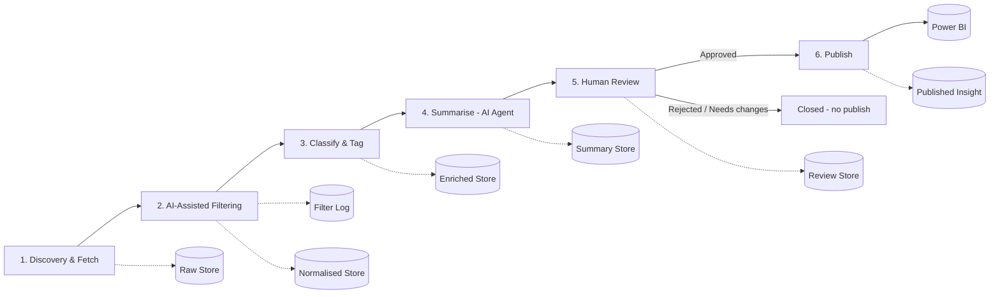
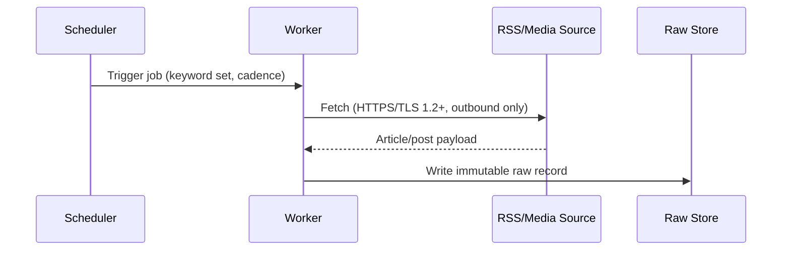
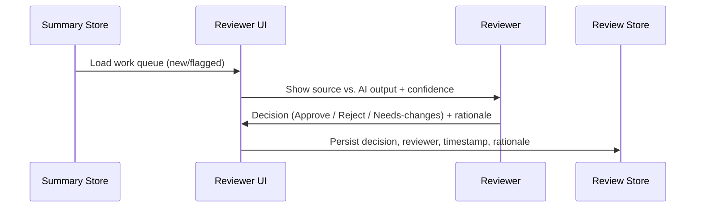
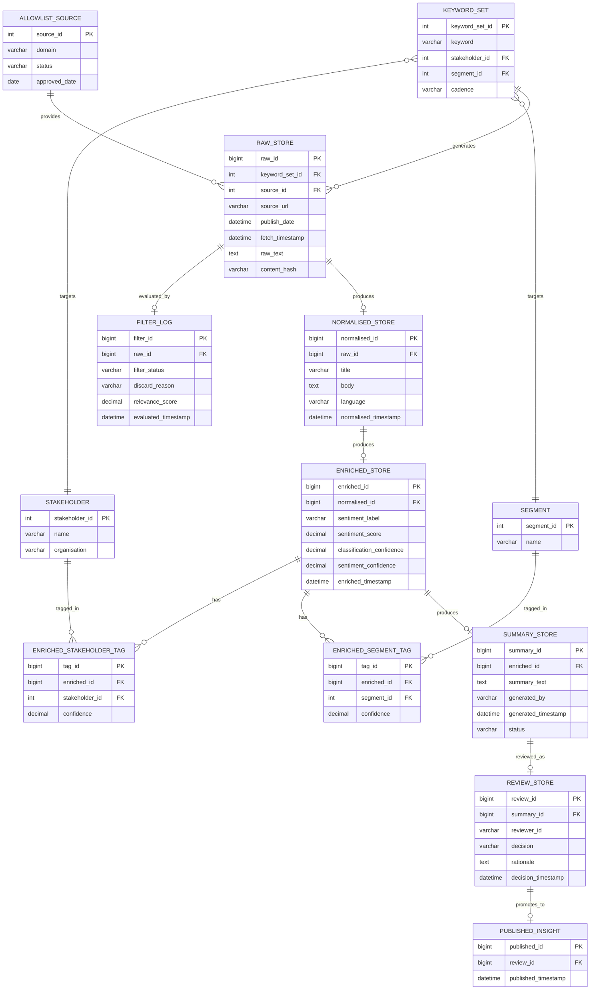

# Media Intelligence Component — Detailed Design

## 1. Overview

The Media Intelligence component is a six-stage pipeline that turns raw web/RSS content into governed, dashboard-ready insight. Every stage writes to its own store so the pipeline is fully auditable end-to-end — any published insight can be traced back to the exact raw article it came from.



---

## 2. Stage-by-Stage Design

### Stage 1 — Discovery & Fetch

**Purpose:** continuously pull candidate content from approved media sources.



**Processing steps:**
1. Scheduler fires a time-based job per configured keyword/topic set, 2–3 times a day (06:00–18:00).
2. Worker calls the allow-listed RSS feed / media API for that keyword set.
3. Worker captures: source URL, source name, publish date, fetch timestamp, raw text, and a content hash (used later for dedup).
4. Record is written **immutably** to the Raw Store — nothing is dropped here, even content that will later fail filtering, so the pipeline stays auditable.
5. Requests blocked by Zscaler or other network controls are logged as fetch errors, not silently dropped.

**Inputs:** keyword/topic set, allow-listed source list.
**Outputs:** Raw Store records.

---

### Stage 2 — AI-Assisted Filtering

**Purpose:** reduce the raw stream to only what is worth enriching.

**Processing steps:**
1. **Allow-list check** — confirm the item's actual originating domain is on the approved list (needed because some feeds aggregate multiple origins).
2. **Relevance filter** — AI/rules check whether the item genuinely mentions or relates to a tracked stakeholder or sector; apply a configurable relevance/confidence threshold.
3. **Deduplication** — compare content hash / near-duplicate similarity against recent items to collapse syndicated or re-published stories.
4. **Decision logging** — every raw item gets a filter outcome recorded (passed / discarded), with a reason code if discarded (`NOT_ALLOWLISTED`, `NOT_RELEVANT`, `DUPLICATE`).
5. Items that pass are written to the **Normalised Store** with clean text and canonical title/body fields.

**Inputs:** Raw Store record.
**Outputs:** Filter Log entry (every item) + Normalised Store record (passed items only).

---

### Stage 3 — Classify & Tag

**Purpose:** attach structured meaning to normalised content.

**Processing steps:**
1. **Entity resolution** — match the item against the stakeholder/segment taxonomy already used in Salesforce (e.g., Scottish Power Networks, SSE Networks; Sea Communities, Visual Impact Groups).
2. **Multi-label tagging** — an item may be tagged against more than one stakeholder and/or segment.
3. **Sentiment scoring** — assign a sentiment label/score with an associated confidence value.
4. **Confidence flagging** — classifications below the confidence threshold are flagged for closer reviewer attention rather than treated the same as high-confidence items.
5. Output is persisted to the **Enriched Store**, plus one row per tag in the entity-tag junction table, all traceable back to the Normalised (and therefore Raw) record.

**Inputs:** Normalised Store record.
**Outputs:** Enriched Store record + entity tag rows.

---

### Stage 4 — Summarise (AI Agent)

**Purpose:** produce the artefact a human reviewer (and ultimately the dashboard) actually consumes.

**Processing steps:**
1. AI agent generates a concise, dashboard-length summary from the enriched record — key facts, named entities, overall sentiment.
2. Summary is packaged together with a reference to its source article and its classification/sentiment output, so a reviewer sees everything in one place without cross-referencing stores manually.
3. Summary is written to the **Summary Store**, status = `PENDING_REVIEW`.

**Inputs:** Enriched Store record.
**Outputs:** Summary Store record.

---

### Stage 5 — Human-in-the-Loop Review

**Purpose:** mandatory control gate — no AI output reaches the dashboard unreviewed.



**Processing steps:**
1. Reviewer UI presents a work queue, prioritising flagged/low-confidence items.
2. Reviewer sees source text side-by-side with AI summary, classification tags, and confidence scores.
3. Reviewer records one of: **Approve**, **Reject**, **Needs-changes**, with free-text rationale.
4. Decision, reviewer identity, decision timestamp and rationale are written to the **Review Store** — this also becomes the feedback signal used to improve future filtering/classification/summarisation quality.

**Inputs:** Summary Store record.
**Outputs:** Review Store record.

---

### Stage 6 — Publish

**Purpose:** promote only approved insight to the analytics layer.

**Processing steps:**
1. Publish Orchestrator polls the Review Store for records with decision = `APPROVED`.
2. Approved record is written to **Published Insight**, the table Power BI actually reads from.
3. Rejected / needs-changes items are never promoted; they remain in the Review Store for audit only.

**Inputs:** Review Store record (approved).
**Outputs:** Published Insight record → Power BI dataset refresh.

---

## 3. Entity-Relationship Diagram



---

## 4. DDL

```sql
-- Lookup tables ---------------------------------------------------

CREATE TABLE stakeholder (
    stakeholder_id      INT IDENTITY(1,1) PRIMARY KEY,
    name                VARCHAR(200) NOT NULL,
    organisation        VARCHAR(200) NULL,
    created_timestamp   DATETIME2 NOT NULL DEFAULT SYSUTCDATETIME()
);

CREATE TABLE segment (
    segment_id          INT IDENTITY(1,1) PRIMARY KEY,
    name                VARCHAR(200) NOT NULL,
    created_timestamp   DATETIME2 NOT NULL DEFAULT SYSUTCDATETIME()
);

CREATE TABLE allowlist_source (
    source_id           INT IDENTITY(1,1) PRIMARY KEY,
    domain              VARCHAR(300) NOT NULL UNIQUE,
    status              VARCHAR(20) NOT NULL DEFAULT 'ACTIVE', -- ACTIVE | SUSPENDED
    approved_date       DATE NOT NULL
);

CREATE TABLE keyword_set (
    keyword_set_id      INT IDENTITY(1,1) PRIMARY KEY,
    keyword             VARCHAR(200) NOT NULL,
    stakeholder_id      INT NULL REFERENCES stakeholder(stakeholder_id),
    segment_id          INT NULL REFERENCES segment(segment_id),
    cadence             VARCHAR(50) NOT NULL DEFAULT '2-3x-daily-0600-1800',
    is_active           BIT NOT NULL DEFAULT 1
);

-- Stage 1: Discovery & Fetch ---------------------------------------

CREATE TABLE raw_store (
    raw_id              BIGINT IDENTITY(1,1) PRIMARY KEY,
    keyword_set_id      INT NOT NULL REFERENCES keyword_set(keyword_set_id),
    source_id           INT NOT NULL REFERENCES allowlist_source(source_id),
    source_url          VARCHAR(1000) NOT NULL,
    publish_date        DATETIME2 NULL,
    fetch_timestamp     DATETIME2 NOT NULL DEFAULT SYSUTCDATETIME(),
    raw_text            NVARCHAR(MAX) NOT NULL,
    content_hash        VARCHAR(64) NOT NULL,
    CONSTRAINT uq_raw_content_hash UNIQUE (content_hash)
);
CREATE INDEX ix_raw_store_fetch_ts ON raw_store(fetch_timestamp);

-- Stage 2: AI-Assisted Filtering ------------------------------------

CREATE TABLE filter_log (
    filter_id           BIGINT IDENTITY(1,1) PRIMARY KEY,
    raw_id              BIGINT NOT NULL UNIQUE REFERENCES raw_store(raw_id),
    filter_status       VARCHAR(20) NOT NULL,   -- PASSED | DISCARDED
    discard_reason      VARCHAR(30) NULL,       -- NOT_ALLOWLISTED | NOT_RELEVANT | DUPLICATE
    relevance_score     DECIMAL(5,4) NULL,
    evaluated_timestamp DATETIME2 NOT NULL DEFAULT SYSUTCDATETIME(),
    CONSTRAINT chk_filter_status CHECK (filter_status IN ('PASSED','DISCARDED'))
);

CREATE TABLE normalised_store (
    normalised_id       BIGINT IDENTITY(1,1) PRIMARY KEY,
    raw_id              BIGINT NOT NULL UNIQUE REFERENCES raw_store(raw_id),
    title               VARCHAR(500) NOT NULL,
    body                NVARCHAR(MAX) NOT NULL,
    language            VARCHAR(10) NOT NULL DEFAULT 'en',
    normalised_timestamp DATETIME2 NOT NULL DEFAULT SYSUTCDATETIME()
);

-- Stage 3: Classify & Tag --------------------------------------------

CREATE TABLE enriched_store (
    enriched_id                 BIGINT IDENTITY(1,1) PRIMARY KEY,
    normalised_id               BIGINT NOT NULL UNIQUE REFERENCES normalised_store(normalised_id),
    sentiment_label             VARCHAR(20) NOT NULL,  -- POSITIVE | NEUTRAL | NEGATIVE
    sentiment_score             DECIMAL(5,4) NOT NULL,
    classification_confidence   DECIMAL(5,4) NOT NULL,
    sentiment_confidence        DECIMAL(5,4) NOT NULL,
    enriched_timestamp          DATETIME2 NOT NULL DEFAULT SYSUTCDATETIME()
);

CREATE TABLE enriched_stakeholder_tag (
    tag_id              BIGINT IDENTITY(1,1) PRIMARY KEY,
    enriched_id         BIGINT NOT NULL REFERENCES enriched_store(enriched_id),
    stakeholder_id      INT NOT NULL REFERENCES stakeholder(stakeholder_id),
    confidence          DECIMAL(5,4) NOT NULL,
    CONSTRAINT uq_enriched_stakeholder UNIQUE (enriched_id, stakeholder_id)
);

CREATE TABLE enriched_segment_tag (
    tag_id              BIGINT IDENTITY(1,1) PRIMARY KEY,
    enriched_id         BIGINT NOT NULL REFERENCES enriched_store(enriched_id),
    segment_id          INT NOT NULL REFERENCES segment(segment_id),
    confidence          DECIMAL(5,4) NOT NULL,
    CONSTRAINT uq_enriched_segment UNIQUE (enriched_id, segment_id)
);

-- Stage 4: Summarise (AI Agent) ---------------------------------------

CREATE TABLE summary_store (
    summary_id          BIGINT IDENTITY(1,1) PRIMARY KEY,
    enriched_id         BIGINT NOT NULL UNIQUE REFERENCES enriched_store(enriched_id),
    summary_text        NVARCHAR(2000) NOT NULL,
    generated_by        VARCHAR(100) NOT NULL,   -- model / agent identifier
    generated_timestamp DATETIME2 NOT NULL DEFAULT SYSUTCDATETIME(),
    status              VARCHAR(20) NOT NULL DEFAULT 'PENDING_REVIEW',
    CONSTRAINT chk_summary_status CHECK (status IN ('PENDING_REVIEW','REVIEWED'))
);

-- Stage 5: Human-in-the-Loop Review -------------------------------------

CREATE TABLE review_store (
    review_id            BIGINT IDENTITY(1,1) PRIMARY KEY,
    summary_id           BIGINT NOT NULL UNIQUE REFERENCES summary_store(summary_id),
    reviewer_id          VARCHAR(100) NOT NULL,
    decision             VARCHAR(20) NOT NULL,   -- APPROVED | REJECTED | NEEDS_CHANGES
    rationale            NVARCHAR(1000) NULL,
    decision_timestamp   DATETIME2 NOT NULL DEFAULT SYSUTCDATETIME(),
    CONSTRAINT chk_review_decision CHECK (decision IN ('APPROVED','REJECTED','NEEDS_CHANGES'))
);

-- Stage 6: Publish ---------------------------------------------------

CREATE TABLE published_insight (
    published_id         BIGINT IDENTITY(1,1) PRIMARY KEY,
    review_id            BIGINT NOT NULL UNIQUE REFERENCES review_store(review_id),
    published_timestamp  DATETIME2 NOT NULL DEFAULT SYSUTCDATETIME()
);
-- Application-level rule: a row may only be inserted here where
-- review_store.decision = 'APPROVED' for the referenced review_id.
```

---

## 5. Relationship Summary

| From | To | Cardinality | Notes |
|---|---|---|---|
| `keyword_set` | `stakeholder` / `segment` | many-to-one (optional) | a keyword set targets a stakeholder and/or a segment |
| `allowlist_source` | `raw_store` | one-to-many | one source produces many fetched items |
| `keyword_set` | `raw_store` | one-to-many | one keyword set produces many fetched items |
| `raw_store` | `filter_log` | one-to-one | every raw item gets exactly one filter decision |
| `raw_store` | `normalised_store` | one-to-zero-or-one | only created if `filter_log.filter_status = PASSED` |
| `normalised_store` | `enriched_store` | one-to-zero-or-one | one enrichment pass per normalised item |
| `enriched_store` | `enriched_stakeholder_tag` / `enriched_segment_tag` | one-to-many | supports multi-label tagging |
| `enriched_store` | `summary_store` | one-to-zero-or-one | one AI-generated summary per enriched item |
| `summary_store` | `review_store` | one-to-zero-or-one | one reviewer decision per summary |
| `review_store` | `published_insight` | one-to-zero-or-one | only exists where decision = `APPROVED` |

This chain (`raw_store` → `filter_log`/`normalised_store` → `enriched_store` → `summary_store` → `review_store` → `published_insight`) gives full lineage: any row in `published_insight` can be traced back through every stage to the original raw fetch, satisfying the traceability and audit requirements in the non-functional section of the HLD.
