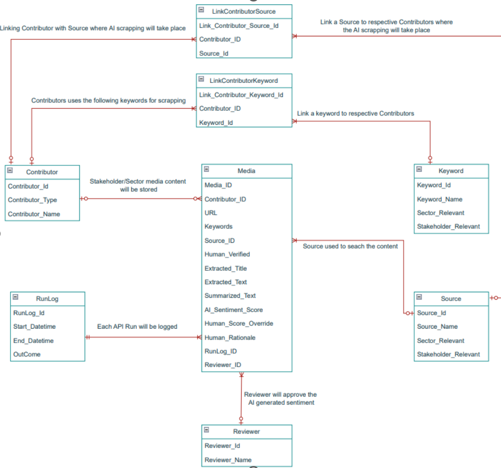

# Media Requirements
- Continuously discover, normalise, and enrich media content about named stakeholders/sectors 
- Route AI-generated sentiment and summaries through a human-in-the-loop approval 
before surfacing on the dashboard. 

## Core Components
- Scheduler & Workers: Time-based jobs that fan out crawl/search tasks per topic/keyword set.
- Processing Pipeline: Online search → deduplication → entity resolution → sentiment & summary → queue for review.
- Review Workflow: A lightweight web app (or module) to approve/reject AI outputs with rationale, tags, and audit trail.
- Publish Orchestrator: Promotes only approved insights to analytics storage for Power BI consumption. 

## Database layer 
- Raw Store: Immutable drops of fetched articles/posts with date, source url, and text. 
- Normalised Store: Clean summarised text, canonical fields (title, body). 
- Enriched Store: Entities (stakeholder, segment), sentiment (score/label), confidence. 
- Review Store: Review status, reviewer details, decision time, rationale. 

## User interfaces & layers 
- Operational UI: Run status, lag/freshness, keyword/topics, and error queues (Ops/Support audience). 
- Reviewer UI: Work queue (new/flagged), side-by-side “source vs. AI output,” confidence scores, and “Approve/Reject/Needs-changes.” 

## Error handling & resilience 
- Zscaler: any websites blocked by Zscaler need to be logged. 

### Database layer

#### Nouns:
- Raw/Normalised/Enriched/Review Store (type of store)
- Articles with data (Raw store)
- Posts with data (Raw store)
- Url (source)  (Raw store)
- Text  (Raw store)
- Text (Clean summarised text on Normalised store)
- Fields (title, body)
- Stakeholder (Enriched Store)
- Segment (Enriched Store)
- Sentiment (Enriched Store)
- Score-Sentiment (Enriched Store)
- Label-Sentiment (Enriched Store)
- Confidence (Sentiment maybe?) (Enriched Store)
- Review Status (Review Store)
- Reviewer Details (Review Store)
- Decision time (Review Store)
- Rationale (Review Store)

## Non Functional
- Media agents communicate outbound only, over HTTPS/TLS 1.2+
- Only allow-listed and compliance-approved news sources. (what is allow list? source/url)
- Media data: ~100–200 items per month processed by the AI agent, of which 10–20% approved 
for dashboard display.
- Storage: Azure SQL for media records <10 MB per month. 
- With time more data sources will be added (media feed?) and the dashboard needs to absorb those datasets. 
- Logs
- Log Retention period

## Design Principles
### Functional Principles
- Raw media is immutable.
- AI outputs are never published directly.
- Human review is mandatory before analytics publication.
- Full audit trail for every AI-generated insight.
- Reprocessing must be supported without re-crawling sources.
- Processing stages must be independently scalable.

- ### Architectural Principles
- Event-driven processing.
- Asynchronous execution.
- Stateless workers.
- UUID primary keys.
- Separation of raw, normalized, enriched, review, and published data.
- Full observability.

## Logical Architecture

                      ┌────────────────────┐
                      │ Scheduler          │
                      └─────────┬──────────┘
                                │
                                ▼
                    ┌───────────────────────┐
                    │ Discovery Workers     │
                    └─────────┬─────────────┘
                              │
                              ▼
                    ┌───────────────────────┐
                    │ Raw Store             │
                    └─────────┬─────────────┘
                              │
                              ▼
                    ┌───────────────────────┐
                    │ Normalisation Worker  │
                    └─────────┬─────────────┘
                              │
                              ▼
                    ┌───────────────────────┐
                    │ Entity Resolution     │
                    └─────────┬─────────────┘
                              │
                              ▼
                    ┌───────────────────────┐
                    │ AI Enrichment         │
                    └─────────┬─────────────┘
                              │
                              ▼
                    ┌───────────────────────┐
                    │ Review Queue          │
                    └─────────┬─────────────┘
                              │
                              ▼
                    ┌───────────────────────┐
                    │ Reviewer Portal       │
                    └─────────┬─────────────┘
                              │
                              ▼
                    ┌───────────────────────┐
                    │ Publish Orchestrator  │
                    └─────────┬─────────────┘
                              │
                              ▼
                    ┌───────────────────────┐
                    │ Analytics Store       │
                    └───────────────────────┘

## Media Service responsibility
The Media Service is responsible for:

- Discovering relevant media content for configured stakeholders and sectors
- Fetching and preserving source content
- Normalising and deduplicating content
- Resolving content to canonical stakeholders/sectors
- Generating AI sentiment, summaries and themes
- Attaching confidence and model/provenance information
- Managing human review and approval
- Publishing only approved insights
- Retaining complete lineage and audit history

It should not own stakeholder master data or the downstream analytics experience. It consumes canonical stakeholder/sector identifiers from an upstream configuration/master-data capability and publishes approved media insights downstream.


## Domain Model
### Topic
Represents an area being monitored.

Examples:
````
- Electricity Markets
- Clean Power 2030
- Balancing Mechanism Reform
````
#### Fields
````
class Topic:
    id: UUID
    name: str
    description: str
    active: bool
    created_at: datetime
    updated_at: datetime
 ````

#### Keyword
Search terms associated with a topic.
````
class Keyword:
    id: UUID
    topic_id: UUID
    phrase: str
    weight: float
    active: bool
 ````

Examples:
````
- NESO
- National Energy System Operator
- Energy Market Reform
````

## Thoughts
Allow-listed Media Sources — All external content for sentiment analysis originates from a curated, legally approved allow-list of domains and APIs.
Table of columns: APIs/folder path =(URL), type=REST/DISK, stake holder=OFFCOM, segment=NUCLEAR, the last 2 column could be one column dict()
NORMALISE - look at raw json and mapp to normalised form - could be one kind or multiple ie a stakeholder has one insight and sector another

## Data Model


# Stage 1 — Minimal database persistence
Goal: prove the smallest possible ingestion path.

Build:
Payload → SQL

Python
  ↓
hard-coded MediaEnvelope
  ↓
SQLAlchemy
  ↓
PostgreSQL

### Implement:

* Content model
* IngestionMetadata model
* async SQLAlchemy
* database transaction
* basic configuration
* unit tests
* integration test

#### Database Migration
pip install alembic
- alembic init migration  # Initialize migration project
- alembic revision -m "create schema ecommerce" # Create our first migration
- __Check/Modify__ the migration file, verify it can run
- alembic upgrade head    # execute migration

#### Run

